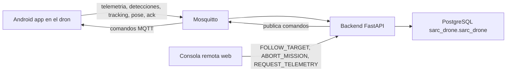
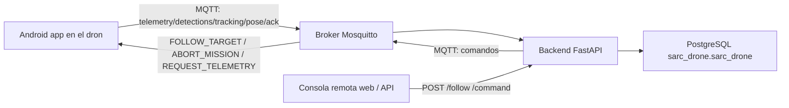

# SARC-Drone en VMware Debian

Esta carpeta contiene la variante recomendada para desplegar el backend del proyecto en una VM Debian dentro de VMware con IP privada independiente.

Si quieres una guía corta para levantarlo y probarlo en pocos minutos, abre [QUICKSTART.md](QUICKSTART.md).

Arquitectura objetivo:

- Android app en el dron: publica telemetria, inferencia, seguimiento y ACK por MQTT.
- Mosquitto en la VM Debian: broker MQTT local de la solucion.
- PostgreSQL en la misma VM Debian: persistencia historica.
- Backend FastAPI en la misma VM Debian: suscribe MQTT, escribe en PostgreSQL y expone API para enviar comandos.

Flujo extremo a extremo:



Base de datos requerida:

- Nombre de la base: `sarc_drone`
- Nombre del esquema: `sarc_drone`

Filosofia de intercambio de datos:

- No se envian imagenes al VM.
- Se publican solo datos estructurados: clases detectadas, confianza, cajas, pose, tracking, telemetria y ACK.
- El VM puede ordenar al dron entrar en modo seguimiento mediante MQTT/API.

## Estructura de carpetas

```text
04_docs/vmware_debian/
├── .env.example
├── docker-compose.yml
├── README.md
├── backend/
│   ├── Dockerfile
│   ├── app.py
│   └── requirements.txt
├── mosquitto/
│   ├── aclfile
│   └── mosquitto.conf
└── postgres/
    └── init/
        └── 001_init.sql
```

## 1) Prerrequisitos en Debian

Instalar Docker y Docker Compose en la VM Debian.

Ejemplo resumido:

```bash
sudo apt update
sudo apt install -y ca-certificates curl gnupg
sudo install -m 0755 -d /etc/apt/keyrings
curl -fsSL https://download.docker.com/linux/debian/gpg | sudo gpg --dearmor -o /etc/apt/keyrings/docker.gpg
sudo chmod a+r /etc/apt/keyrings/docker.gpg
echo \
  "deb [arch=$(dpkg --print-architecture) signed-by=/etc/apt/keyrings/docker.gpg] https://download.docker.com/linux/debian \
  $(. /etc/os-release && echo \"$VERSION_CODENAME\") stable" | \
  sudo tee /etc/apt/sources.list.d/docker.list > /dev/null
sudo apt update
sudo apt install -y docker-ce docker-ce-cli containerd.io docker-buildx-plugin docker-compose-plugin
sudo usermod -aG docker $USER
```

## 1.1) Visión general del flujo



Puntos clave:

- La app no envía imágenes.
- El backend persiste solo datos estructurados.
- La consola remota controla el dron a través del backend.
- Mosquitto y PostgreSQL pueden convivir en la misma VM Debian.

## 2) IP privada de la VM

Asigna una IP privada estable a la VM, por ejemplo `192.168.56.20` o la que use tu red VMware.

Los puertos que se exponen son:

- `1883` MQTT
- `5432` PostgreSQL
- `8000` API backend

## 3) Variables de entorno

Copia el archivo de ejemplo:

```bash
cp .env.example .env
```

Edita los secretos antes de levantar el stack.

## 4) Configurar Mosquitto

La configuración base está en `mosquitto/mosquitto.conf`.

Debes crear el archivo de contraseñas del broker en la VM o dentro del contenedor.

Ejemplo para crear usuarios:

```bash
docker run --rm -it \
  -v "$PWD/mosquitto:/mosquitto/config" \
  eclipse-mosquitto \
  mosquitto_passwd -c /mosquitto/config/passwords drone_client
```

Luego repite para el backend:

```bash
docker run --rm -it \
  -v "$PWD/mosquitto:/mosquitto/config" \
  eclipse-mosquitto \
  mosquitto_passwd /mosquitto/config/passwords backend_service
```

ACL esperado:

- `drone_client` puede escribir telemetria, detecciones, tracking, pose y ack.
- `backend_service` puede leer eventos y escribir comandos.
- No dejar `allow_anonymous true` en producción.

## 5) Levantar la pila completa

```bash
docker compose up -d --build
```

Servicios esperados:

- `sarc-postgres`
- `sarc-mosquitto`
- `sarc-edge-backend`

Si quieres reiniciar el stack completo desde cero:

```bash
docker compose down -v
docker compose up -d --build
```

## 6) Verificacion rapida

Health del backend:

```bash
curl http://192.168.56.20:8000/health
```

Consola remota web:

```bash
http://192.168.56.20:8000/console
```

Desde esa pagina puedes:

- Ver eventos recientes del dron.
- Guardar el `drone_id` en el navegador.
- Filtrar eventos por `telemetry`, `detections`, `tracking`, `pose` o `ack`.
- Exportar los eventos en JSON.
- Ver vistas rapidas de `tracking` y `pose`.
- Enviar `FOLLOW_TARGET`.
- Enviar `ABORT_MISSION`.
- Enviar `REQUEST_TELEMETRY`.

Probar MQTT:

```bash
docker exec -it sarc-mosquitto mosquitto_sub -h localhost -p 1883 -u drone_client -P TU_PASSWORD -t 'sarc/drone/#' -v
```

Probar publicación de evento ficticio:

```bash
docker exec -it sarc-mosquitto mosquitto_pub -h localhost -p 1883 -u drone_client -P TU_PASSWORD \
  -t sarc/drone/telemetry -m '{"drone_id":"sarc_drone_001","timestamp":1730000000000,"lat":0.0,"lon":0.0,"alt":20.0,"search_pattern":"lawnmower","fps":12.5}'
```

Enviar comando de prueba:

```bash
curl -X POST http://192.168.56.20:8000/command/sarc_drone_001 \
  -H 'Content-Type: application/json' \
  -d '{"id":"cmd-1","type":"REQUEST_TELEMETRY"}'
```

Probar seguimiento remoto:

```bash
curl -X POST "http://192.168.56.20:8000/follow/sarc_drone_001?enabled=true"
```

Probar aborto de mision:

```bash
curl -X POST http://192.168.56.20:8000/command/sarc_drone_001 \
  -H 'Content-Type: application/json' \
  -d '{"id":"cmd-2","type":"ABORT_MISSION"}'
```

## 7) Topics MQTT usados

- `sarc/drone/telemetry`
- `sarc/drone/detections`
- `sarc/drone/tracking`
- `sarc/drone/pose`
- `sarc/drone/ack`
- `sarc/commands/drone/{drone_id}`

Eventos que publica la app:

- `telemetry`: posicion, altitud, FPS y patron de busqueda.
- `detections`: clase, confianza, bounding box y posicion del dron.
- `tracking`: objetivo, caja, centro del blanco y estado de seguimiento.
- `pose`: pose o keypoints si se habilitan en una etapa posterior.
- `ack`: confirmacion de comandos recibidos o ejecutados.

Comandos que publica el backend:

- `FOLLOW_TARGET`
- `ABORT_MISSION`
- `REQUEST_TELEMETRY`
- `MANUAL_CONTROL`
- `SET_SEARCH_PATTERN`
- `CHANGE_TARGET`

Semántica recomendada:

- `telemetry`: lat/lon/alt, modo de búsqueda, FPS y estado general.
- `detections`: clase, confianza, bbox y posición del dron.
- `tracking`: objetivo, bbox, estado de seguimiento y comando sugerido.
- `pose`: datos de pose/landmarks si luego se añade el modelo de pose.
- `ack`: confirmación de ejecución de comandos.

Comando de seguimiento remoto:

- `POST /follow/{drone_id}`
- Publica un comando `FOLLOW_TARGET` al topic del dron.

Consola web remota:

- `GET /console`
- Lee eventos desde `GET /events/{drone_id}`.
- Envía comandos a `POST /command/{drone_id}` y `POST /follow/{drone_id}`.

## 8) Tablas PostgreSQL

Se crean bajo el esquema `sarc_drone`:

- `events`
- `commands`
- `pose_events`

Uso de tablas:

- `events`: histórico general de todo lo que llega por MQTT.
- `pose_events`: vista optimizada para eventos de pose.
- `commands`: auditoria de comandos enviados y su estado de ACK.

Ejemplo de esquema lógico:

```text
sarc_drone.events
  - drone_id
  - event_type
  - topic
  - payload
  - source_timestamp
  - received_at

sarc_drone.commands
  - command_id
  - drone_id
  - command_type
  - topic
  - payload
  - status
  - requested_by
  - created_at
  - updated_at

sarc_drone.pose_events
  - drone_id
  - class_name
  - confidence
  - topic
  - payload
  - source_timestamp
  - received_at
```

Esquema recomendado:

- Base de datos: `sarc_drone`
- Esquema: `sarc_drone`

Campos principales:

- `events.payload` guarda JSONB con el contenido completo del evento.
- `commands.payload` guarda el comando enviado y su estado.
- `pose_events.payload` guarda los datos de pose sin imágenes.

## 9) Integracion con la app Android

La app debe apuntar al broker de la VM Debian:

- host: `192.168.56.20` o la IP real de tu VM
- puerto: `1883`
- usuario: `drone_client`

La consola remota debe usar la API del backend en vez de tocar PostgreSQL directamente.

La app no debe enviar imagenes al VM; solo metadatos de inferencia, pose, seguimiento y estado.

Campos recomendados que debe incluir la app en los JSON:

- `drone_id`
- `timestamp`
- `class` o `class_name`
- `confidence`
- `bbox`
- `target`
- `drone_position`
- `fps`
- `tracking_enabled`
- `source`
- `command` cuando aplique

Para que la app funcione con la VM:

- Cambiar el broker MQTT al IP privado de la VM.
- Mantener el mismo `drone_id` en la app y en la consola.
- Verificar que el topic de comandos sea `sarc/commands/drone/{drone_id}`.

## 10) Orden de despliegue recomendado

1. Instalar Docker en Debian.
2. Asignar IP privada estable a la VM.
3. Configurar `.env`.
4. Crear passwords de Mosquitto.
5. Ejecutar `docker compose up -d --build`.
6. Actualizar la app Android con la IP del broker.
7. Probar telemetria, detecciones, tracking y comandos.
8. Abrir `http://IP_DE_LA_VM:8000/console` y validar eventos y comandos.

## 11) Referencias rapidas

Para el flujo paso a paso y las pruebas exactas, usa [QUICKSTART.md](QUICKSTART.md).

Para la descripcion completa de la pila, payloads, tablas y troubleshooting, este README es la referencia principal.

## 12) Troubleshooting rapido

### La consola web no carga

- Verifica que el puerto `8000` esté expuesto.
- Revisa `docker compose logs -f backend`.
- Comprueba `http://IP_DE_LA_VM:8000/health`.

### MQTT no conecta

- Revisa usuario, contraseña y ACL.
- Revisa `mosquitto.log`.
- Comprueba que la app use la IP privada correcta de la VM.

### No se guardan eventos en PostgreSQL

- Verifica que `POSTGRES_DB=sarc_drone` y `POSTGRES_SCHEMA=sarc_drone`.
- Revisa `docker compose logs -f backend`.
- Comprueba que llegue `drone_id` en el payload.

### No responde FOLLOW_TARGET

- Verifica que la app esté suscrita a `sarc/commands/drone/{drone_id}`.
- Revisa el `ACK` en `sarc/drone/ack`.
- Asegúrate de que `trackingEnabled` se active desde el comando.
